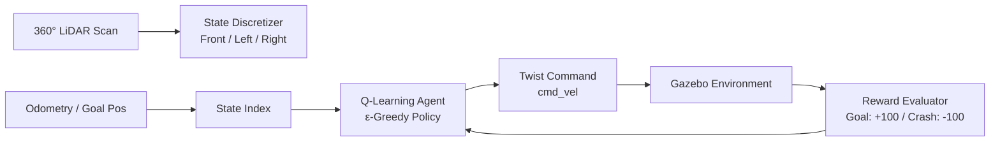

# 🤖 Delivery Bot ROS 2

A ROS 2-based autonomous delivery robot implementing **Reinforcement Learning (Q-Learning)** for obstacle avoidance and point-to-point goal navigation with 360° LiDAR perception.


## 🎯 Features

- **Reinforcement Learning Navigation**: Tabular Q-Learning agent trained for collision-free waypoint navigation.
- **State Space Discretization**: Real-time 360° LiDAR range discretization (left, front, right sectors).
- **Reward Shaping**: Goal-reaching incentives, collision penalties, and step cost optimization.
- **Q-Table Persistence**: Continuous policy training with serialized Q-table saving and loading.
- **Gazebo Simulation**: Custom delivery environment with obstacles and target drop-off zones.
- **RViz Visualization**: Real-time laser scan and robot odometry visualization.

## 📁 Project Structure

```
delivery_bot_ws/
├── src/
│   ├── delivery_bot_ai/          # RL navigation & training package
│   │   ├── delivery_bot_ai/
│   │   │   ├── obstacle_avoidance_agent.py  # Q-learning agent node
│   │   │   ├── training_manager.py          # Episode management & metrics
│   │   │   └── reset_service.py             # Simulation reset service
│   │   ├── config/
│   │   │   └── training_config.yaml         # Hyperparameters (alpha, gamma, epsilon)
│   │   └── launch/
│   │       ├── ai_nav.launch.py             # Run pre-trained navigation
│   │       └── training.launch.py           # Launch training pipeline
│   ├── delivery_bot_description/ # Robot URDF/Xacro models & RViz config
│   │   ├── urdf/
│   │   │   └── robot.urdf.xacro
│   │   └── launch/
│   │       └── display.launch.py
│   └── delivery_bot_gazebo/      # Gazebo simulation world & launch
│       ├── worlds/
│       │   └── delivery_zone.sdf
│       └── launch/
│           └── sim.launch.py
```

## 🧠 Navigation Architecture (Q-Learning)

The navigation policy is driven by a model-free Q-Learning agent:



### Hyperparameters
- **Learning Rate ($\alpha$)**: 0.1
- **Discount Factor ($\gamma$)**: 0.95
- **Exploration ($\epsilon$)**: 1.0 decaying to 0.05
- **Convergence**: Persistent Q-table storage in `q_table.pkl`

## 🛠️ Prerequisites

- Ubuntu 22.04 LTS
- ROS 2 Humble Desktop
- Gazebo Fortress (Ignition Gazebo)
- Python 3.10+ (`numpy`, `rclpy`)

## 📦 Installation & Build

1. **Clone the repository**
```bash
git clone https://github.com/ibrahimaniasse/delivery-bot-ros2.git
cd delivery-bot-ros2
```

2. **Install ROS dependencies**
```bash
cd delivery_bot_ws
rosdep update
rosdep install --from-paths src --ignore-src -r -y
```

3. **Build the workspace**
```bash
colcon build --symlink-install
source install/setup.bash
```

## 🚀 Usage

### 1. Launch Simulation & Robot
```bash
ros2 launch delivery_bot_gazebo sim.launch.py
```

### 2. Launch RViz Visualization
```bash
ros2 launch delivery_bot_description display.launch.py
```

### 3. Run Autonomous RL Navigation
```bash
ros2 launch delivery_bot_ai ai_nav.launch.py
```

### 4. (Optional) Run Training Mode
```bash
ros2 launch delivery_bot_ai training.launch.py
```

## 📄 License

This project is licensed under the MIT License.
